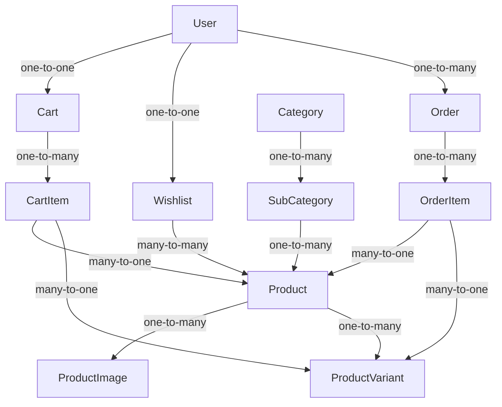

# GlowCare E-commerce - Models Documentation

## Overview
This document provides a complete overview of all Django models in the GlowCare e-commerce project. Each model includes its fields, relationships, properties, and metadata.

---

## Store App Models (Product Catalog)

### 1. Category Model
**File:** `store/models.py`

| Field Name | Field Type | Parameters | Description |
|------------|------------|------------|-------------|
| `name` | CharField | `max_length=100` | Category name |
| `slug` | SlugField | `unique=True, blank=True` | URL-friendly identifier |
| `category_type` | CharField | `max_length=20, choices=CATEGORY_CHOICES, default='face'` | Skincare category type (Face/Body/Hair/Makeup/Wellness) |
| `image` | ImageField | `upload_to='categories/', blank=True, null=True` | Category image |
| `description` | TextField | `blank=True` | Category description |

**Meta Information:**
- `verbose_name_plural = 'Categories'`

**Methods & Properties:**
- `save()`: Auto-generates slug from `category_type` and `name`
- `__str__()`: Returns "Category Type - Name" format

**Relationships:**
- Has many `SubCategory` objects (related_name='subcategories')

---

### 2. SubCategory Model
**File:** `store/models.py`

| Field Name | Field Type | Parameters | Description |
|------------|------------|------------|-------------|
| `category` | ForeignKey | `Category, on_delete=CASCADE, related_name='subcategories'` | Parent category |
| `name` | CharField | `max_length=100` | Subcategory name |
| `slug` | SlugField | `unique=True, blank=True` | URL-friendly identifier |
| `image` | ImageField | `upload_to='subcategories/', blank=True, null=True` | Subcategory image |

**Meta Information:**
- `verbose_name_plural = 'SubCategories'`

**Methods & Properties:**
- `save()`: Auto-generates slug from category slug and name
- `__str__()`: Returns "Category > Subcategory" format

**Relationships:**
- Belongs to one `Category`
- Has many `Product` objects (related_name='products')

---

### 3. Product Model
**File:** `store/models.py`

| Field Name | Field Type | Parameters | Description |
|------------|------------|------------|-------------|
| `subcategory` | ForeignKey | `SubCategory, on_delete=CASCADE, related_name='products'` | Parent subcategory |
| `name` | CharField | `max_length=200` | Product name |
| `slug` | SlugField | `unique=True, blank=True` | URL-friendly identifier |
| `description` | TextField | - | Product description |
| `price` | DecimalField | `max_digits=10, decimal_places=2` | Original price |
| `discount_price` | DecimalField | `max_digits=10, decimal_places=2, blank=True, null=True` | Discounted price |
| `stock` | PositiveIntegerField | `default=0` | Legacy stock field |
| `image` | ImageField | `upload_to='products/'` | Main product image |
| `tag` | CharField | `max_length=20, choices=PRODUCT_TAG_CHOICES, blank=True, default=''` | Product tag (New/Sale/Best Seller/Featured) |
| `is_active` | BooleanField | `default=True` | Product status |
| `created_at` | DateTimeField | `auto_now_add=True` | Creation timestamp |

**Methods & Properties:**
- `save()`: Auto-generates slug from product name
- `final_price`: Property returning discount_price if available, else price
- `total_stock`: Property returning sum of variant stocks or legacy stock
- `is_in_stock`: Property checking if total_stock > 0
- `available_sizes`: Property returning distinct sizes with stock > 0
- `available_colors`: Property returning distinct colors with stock > 0
- `__str__()`: Returns product name

**Relationships:**
- Belongs to one `SubCategory`
- Has many `ProductImage` objects (related_name='images')
- Has many `ProductVariant` objects (related_name='variants')

---

### 4. ProductImage Model
**File:** `store/models.py`

| Field Name | Field Type | Parameters | Description |
|------------|------------|------------|-------------|
| `product` | ForeignKey | `Product, on_delete=CASCADE, related_name='images'` | Parent product |
| `image` | ImageField | `upload_to='products/gallery/'` | Additional product image |

**Methods & Properties:**
- `__str__()`: Returns "Image for {product_name}"

**Relationships:**
- Belongs to one `Product`

---

### 5. ProductVariant Model
**File:** `store/models.py`

| Field Name | Field Type | Parameters | Description |
|------------|------------|------------|-------------|
| `product` | ForeignKey | `Product, on_delete=CASCADE, related_name='variants'` | Parent product |
| `size` | CharField | `max_length=20, choices=SIZE_CHOICES` | Size option |
| `color` | CharField | `max_length=20, choices=COLOR_CHOICES, blank=True` | Color option |
| `stock` | PositiveIntegerField | `default=0` | Available stock for this variant |
| `sku` | CharField | `max_length=100, blank=True` | Stock Keeping Unit |

**Meta Information:**
- `unique_together = ('product', 'size', 'color')`
- `ordering = ['size']`

**Methods & Properties:**
- `is_in_stock`: Property checking if stock > 0
- `__str__()`: Returns "Product Name / Size / Color" format

**Relationships:**
- Belongs to one `Product`

---

## Users App Models

### 6. User Model (Custom)
**File:** `users/models.py`

| Field Name | Field Type | Parameters | Description |
|------------|------------|------------|-------------|
| `email` | EmailField | `unique=True` | Email address (used as username) |
| `phone` | CharField | `max_length=20, blank=True` | Phone number |
| `address` | TextField | `blank=True` | Shipping address |
| `profile_picture` | ImageField | `upload_to='profiles/', blank=True, null=True` | Profile image |

**Configuration:**
- `USERNAME_FIELD = 'email'`
- `REQUIRED_FIELDS = ['username']`
- Inherits from `AbstractUser` (includes username, first_name, last_name, password, etc.)

**Methods & Properties:**
- `__str__()`: Returns email address

**Relationships:**
- Has one `Cart` object (related_name='cart')
- Has one `Wishlist` object (related_name='wishlist')
- Has many `Order` objects (related_name='orders')

---

## Cart App Models

### 7. Cart Model
**File:** `cart/models.py`

| Field Name | Field Type | Parameters | Description |
|------------|------------|------------|-------------|
| `user` | OneToOneField | `settings.AUTH_USER_MODEL, on_delete=CASCADE, related_name='cart'` | Owner user |
| `created_at` | DateTimeField | `auto_now_add=True` | Cart creation timestamp |

**Methods & Properties:**
- `total`: Property returning sum of all cart item subtotals
- `item_count`: Property returning number of items in cart
- `__str__()`: Returns "Cart of {user_email}"

**Relationships:**
- Belongs to one `User`
- Has many `CartItem` objects (related_name='items')

---

### 8. CartItem Model
**File:** `cart/models.py`

| Field Name | Field Type | Parameters | Description |
|------------|------------|------------|-------------|
| `cart` | ForeignKey | `Cart, on_delete=CASCADE, related_name='items'` | Parent cart |
| `product` | ForeignKey | `Product, on_delete=CASCADE` | Product reference |
| `variant` | ForeignKey | `ProductVariant, on_delete=SET_NULL, null=True, blank=True` | Selected variant |
| `quantity` | PositiveIntegerField | `default=1` | Quantity in cart |

**Meta Information:**
- `unique_together = ('cart', 'product', 'variant')`

**Methods & Properties:**
- `size`: Property returning variant size if exists
- `color`: Property returning variant color if exists
- `subtotal`: Property returning product.final_price * quantity
- `__str__()`: Returns formatted item description

**Relationships:**
- Belongs to one `Cart`
- Belongs to one `Product`
- Belongs to one `ProductVariant` (optional)

---

## Orders App Models

### 9. Order Model
**File:** `orders/models.py`

| Field Name | Field Type | Parameters | Description |
|------------|------------|------------|-------------|
| `user` | ForeignKey | `settings.AUTH_USER_MODEL, on_delete=CASCADE, related_name='orders'` | Customer |
| `status` | CharField | `max_length=20, choices=ORDER_STATUS, default='pending'` | Order status |
| `full_name` | CharField | `max_length=200` | Customer full name |
| `email` | EmailField | - | Customer email |
| `phone` | CharField | `max_length=20` | Customer phone |
| `address` | TextField | - | Shipping address |
| `city` | CharField | `max_length=100` | City |
| `postal_code` | CharField | `max_length=20` | Postal/ZIP code |
| `total_amount` | DecimalField | `max_digits=10, decimal_places=2` | Order total |
| `created_at` | DateTimeField | `auto_now_add=True` | Order creation timestamp |
| `updated_at` | DateTimeField | `auto_now=True` | Last update timestamp |

**Meta Information:**
- `ordering = ['-created_at']`

**Methods & Properties:**
- `__str__()`: Returns "Order #{id} by {user_email}"

**Relationships:**
- Belongs to one `User`
- Has many `OrderItem` objects (related_name='items')

---

### 10. OrderItem Model
**File:** `orders/models.py`

| Field Name | Field Type | Parameters | Description |
|------------|------------|------------|-------------|
| `order` | ForeignKey | `Order, on_delete=CASCADE, related_name='items'` | Parent order |
| `product` | ForeignKey | `Product, on_delete=SET_NULL, null=True` | Product reference |
| `variant` | ForeignKey | `ProductVariant, on_delete=SET_NULL, null=True, blank=True` | Variant reference |
| `product_name` | CharField | `max_length=200` | Snapshot of product name |
| `size` | CharField | `max_length=20, blank=True` | Snapshot of size |
| `color` | CharField | `max_length=20, blank=True` | Snapshot of color |
| `price` | DecimalField | `max_digits=10, decimal_places=2` | Price at time of purchase |
| `quantity` | PositiveIntegerField | - | Quantity purchased |

**Methods & Properties:**
- `subtotal`: Property returning price * quantity
- `__str__()`: Returns "{quantity}x {product_name}"

**Relationships:**
- Belongs to one `Order`
- Belongs to one `Product` (nullable)
- Belongs to one `ProductVariant` (nullable)

---

## Wishlist App Models

### 11. Wishlist Model
**File:** `wishlist/models.py`

| Field Name | Field Type | Parameters | Description |
|------------|------------|------------|-------------|
| `user` | OneToOneField | `settings.AUTH_USER_MODEL, on_delete=CASCADE, related_name='wishlist'` | Owner user |
| `products` | ManyToManyField | `Product, blank=True` | Products in wishlist |

**Methods & Properties:**
- `count`: Property returning number of products in wishlist
- `__str__()`: Returns "Wishlist of {user_email}"

**Relationships:**
- Belongs to one `User`
- Has many `Product` objects (many-to-many)

---

## Choice Constants

### Store App Choices:
**CATEGORY_CHOICES:**
- `('face', 'Face Care')`
- `('body', 'Body Care')`
- `('hair', 'Hair Care')`
- `('makeup', 'Makeup')`
- `('wellness', 'Wellness')`

**PRODUCT_TAG_CHOICES:**
- `('', 'None')`
- `('new', 'New Arrival')`
- `('sale', 'Sale')`
- `('best_seller', 'Best Seller')`
- `('featured', 'Featured')`

**SIZE_CHOICES:**
- `('XS', 'XS'), ('S', 'S'), ('M', 'M'), ('L', 'L'), ('XL', 'XL'), ('XXL', 'XXL')`
- `('ONE SIZE', 'One Size')`
- `('28', '28'), ('30', '30'), ('32', '32'), ('34', '34'), ('36', '36'), ('38', '38')`
- `('3-4Y', '3-4Y'), ('5-6Y', '5-6Y'), ('7-8Y', '7-8Y'), ('9-10Y', '9-10Y'), ('11-12Y', '11-12Y')`

**COLOR_CHOICES:**
- `('black', 'Black'), ('white', 'White'), ('grey', 'Grey')`
- `('navy', 'Navy'), ('blue', 'Blue'), ('red', 'Red')`
- `('green', 'Green'), ('beige', 'Beige'), ('brown', 'Brown')`
- `('pink', 'Pink'), ('yellow', 'Yellow'), ('orange', 'Orange')`
- `('purple', 'Purple'), ('multicolor', 'Multicolor')`

### Orders App Choices:
**ORDER_STATUS:**
- `('pending', 'Pending')`
- `('confirmed', 'Confirmed')`
- `('shipped', 'Shipped')`
- `('delivered', 'Delivered')`
- `('cancelled', 'Cancelled')`

---

## Database Schema Summary

**Total Models:** 11
**Total Apps:** 5 (store, users, cart, orders, wishlist)

---

## Notes
1. All models use `Django's default auto-incrementing primary key (id)`
2. Image fields require `Pillow` library for image processing
3. Slug fields are auto-generated if not provided
4. Custom User model requires `AUTH_USER_MODEL = 'users.User'` in settings
5. Database relationships maintain referential integrity with appropriate `on_delete` behaviors